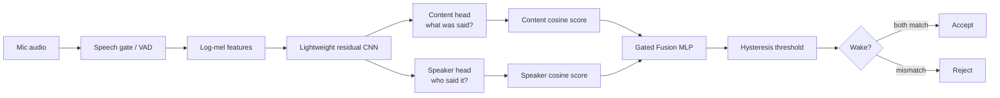
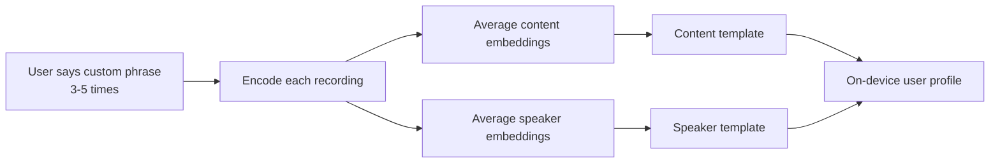
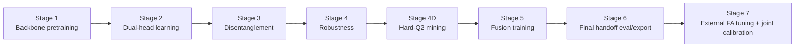

# SoloSpeak

**Personalized wake-word detection for Samsung devices.**

SoloSpeak is a lightweight, on-device voice AI prototype built for **Samsung ennovateX 2026 - AI / Voice Intelligence**. Unlike a normal wake-word detector that asks only _"was the phrase spoken?"_, SoloSpeak asks two questions before waking a device:

1. **Was the enrolled phrase spoken?**
2. **Was it spoken by the enrolled user?**

In short:

> **SoloSpeak wakes for your phrase, in your voice - not for anyone who copies the phrase.**

---

## Final Prototype Status

| Item | Status |
|---|---|
| Final artifact | `exports/solospeak_stage7_deployable_corrected.pt` |
| Final threshold | `tau_on ~= 0.27` |
| Model size | `1,100,897` parameters, about **1.10M** |
| Runtime direction | ONNX / INT8 export path for edge deployment |
| Privacy boundary | On-device templates; no raw enrollment audio required by default |
| Final state | **Built, trained, evaluated, exported - prototype-ready** |

The final model is the **Stage 7 corrected deployable**. An earlier external-false-accept-only calibration selected a much higher threshold (`tau ~= 0.935`), but that damaged true accepts. The final version uses **joint calibration** across internal Q1/Q2/Q3/Q4 verification scores and external false-accept scores.

---

## Final Results

Validation combines internal quadrant testing with **40,000 external false-accept trials** from Common Voice, LibriSpeech, background noise, and UrbanSound8K style sources.

| Metric | Final Stage 7 Result |
|---|---:|
| Clean True Accept | **93.97%** |
| Wrong-speaker rejection | **95.17%** |
| Wrong-word rejection | **97.83%** |
| Background rejection | **100.00%** |
| Quadrant minimum | **93.97%** |
| External false-accept rate | **0.30%** |
| External false accepts | **120 / 40,000** |
| Final threshold | **0.27** |

This is a **production-candidate hackathon prototype**, not a field-certified commercial wake-word system. Real Samsung-device microphone testing, latency profiling, replay/cloned-voice evaluation, and UX validation are still required before productization.

---

## The Problem

Most wake-word systems are phrase-centric. If the phrase is spoken clearly enough, the device may wake - even if the speaker is not the owner.

That creates four practical failure modes:

| Scenario | Example | Desired behavior |
|---|---|---|
| Correct user + correct phrase | Owner says the enrolled phrase | **Accept** |
| Wrong user + correct phrase | Friend copies the phrase | **Reject** |
| Correct user + wrong phrase | Owner says a similar word | **Reject** |
| Background / non-speech | TV, fan, noise, random speech | **Reject** |

SoloSpeak is designed around this four-quadrant decision problem rather than plain keyword spotting.

---

## Core Idea

SoloSpeak separates speech into two embedding spaces:

- **Content embedding (`z_c`)** - captures _what was said_
- **Speaker embedding (`z_s`)** - captures _who said it_

At runtime, the model compares both embeddings against the enrolled user's templates and lets a small fusion network make the final wake decision.



---

## Runtime Architecture

The runtime path is intentionally small and edge-oriented:

```text
16 kHz mono audio
    -> speech gate / silence gate
    -> 1.6 s analysis window
    -> 80 x 160 log-mel spectrogram
    -> SoloSpeakResNet backbone
    -> 128-d content embedding + 128-d speaker embedding
    -> cosine match against enrolled templates
    -> 361-parameter Gated Fusion MLP
    -> hysteresis accept/reject decision
```

### Audio Features

- Sample rate: **16 kHz mono**
- Window: **1.6 s**, `25,600` samples
- FFT / window length: `400`
- Hop length: `160`
- Mel bins: `80`
- Final model input: `(B, 1, 80, 160)`

The repository includes both:

- `solospeak/data/features.py` - PyTorch training-time log-mel extractor
- `solospeak/data/features_deploy.py` - NumPy deployment-time log-mel extractor

Both are kept numerically aligned through tests.

### Backbone

The backbone is implemented as `SoloSpeakResNet`, a compact residual CNN using the project config alias `bcresnet8`.

Important nuance: the code preserves the `bcresnet*` naming for continuity with the experiment plan, but the implemented backbone is a **project-specific residual CNN**, not a literal reproduction of the BC-ResNet paper.

### Dual Heads

Both heads produce L2-normalized 128-dimensional embeddings:

```text
content_head -> z_c: phrase / content identity
speaker_head -> z_s: speaker / voice identity
```

### Fusion Head

The final decision is made by a tiny MLP over six similarity features:

```text
[s_c, s_s, s_c * s_s, |s_c - s_s|, s_c^2, s_s^2]
```

where:

- `s_c` = content-template cosine similarity
- `s_s` = speaker-template cosine similarity

The fusion network has only **361 parameters** and learns an AND-like decision boundary: wake only when both phrase and voice match.

### VAD / Speech Gate

The deployment package includes a `SileroVAD` ONNX wrapper at:

```text
solospeak/models/vad.py
```

The current Python streaming inference path also contains a lightweight RMS silence gate to skip near-silent frames before running the full model. In product terms, VAD is used as a **runtime pre-filter**, not as the core training objective.

---

## Enrollment Flow

A user enrolls once by speaking a custom phrase a few times.



Each stored profile contains:

- `content_template`: 128 x float32
- `speaker_template`: 128 x float32
- `tau`: user/model threshold
- metadata: user id, keyword text, model version

The profile is about **1.1 KB** and does not need to store raw enrollment audio by default.

---

## Training Curriculum

The final system was trained through a staged reliability curriculum. The **Kaggle notebooks in `notebooks/` are the historical source of the actual GPU training runs**, while the repository ports those successful paths into source-controlled scripts.



| Stage | Purpose |
|---|---|
| Stage 1 - Backbone pretraining | Learn general speech-command acoustic features. |
| Stage 2 - Dual-head learning | Learn separate content and speaker representations. |
| Stage 3 - Disentanglement | Reduce leakage between phrase identity and speaker identity using orthogonality and adversarial training. |
| Stage 4 - Robustness | Improve behavior under noise, augmentation, and harder audio conditions. |
| Stage 4D - Hard-Q2 mining | Attack the hardest personalized wake-word failure: wrong speaker saying the correct phrase. |
| Stage 5 - Fusion training | Freeze encoder/heads and train the final content+speaker fusion decision layer. |
| Stage 6 - Final handoff | Evaluate/export the Stage 5 candidate into a deployable checkpoint. |
| Stage 7 - External FA tuning | Tune against external false accepts, rebuild internal verification scores, and export the corrected threshold. |

The final Stage 5 winner uses:

```text
stage4_candidate = stage4d_hardq2_mining_balanced
data_variant     = zero_e3_product
fusion_variant   = q2_very_strong
```

---

## Losses and Disentanglement

SoloSpeak combines several training signals across stages:

- **Supervised contrastive loss** for content clusters and speaker clusters
- **Auxiliary classification** for word and speaker supervision
- **Orthogonality loss** to decorrelate `z_c` and `z_s`
- **Gradient reversal / adversarial probes** so content embeddings become less speaker-predictive and speaker embeddings become less word-predictive
- **Binary fusion loss** for final accept/reject learning

The key technical design is simple:

> Make `z_c` good at phrase identity, make `z_s` good at speaker identity, and penalize each one for carrying the other's information.

---

## Data Usage

The full training/evaluation path uses public audio sources for the base model and external false-accept validation. User-specific personalization comes only from enrollment samples.

| Data source | Role in SoloSpeak |
|---|---|
| Google Speech Commands v2 | Keyword / phrase learning, quadrant construction |
| VoxCeleb-style speaker data | Speaker variability and speaker embedding support where available |
| LibriSpeech / LibriPhrase | Multi-speaker clean speech, phrase/speaker challenges |
| Common Voice | External real-world speech false-accept testing |
| UrbanSound8K / background noise | Non-speech and environmental rejection testing |
| MUSAN / RIR-style augmentation | Noise and room robustness where configured |
| User enrollment samples | Build compact personal content and speaker templates |

Raw audio and large generated artifacts are intentionally not committed to git. See `data/README.md` for manifest structure and dataset preparation notes.

---

## Open Models / Deployment Components

| Component | Role |
|---|---|
| SoloSpeak Stage 7 model | Final personalized wake-word decision model |
| Silero VAD v4 ONNX wrapper | Runtime speech/activity gate before expensive inference |
| ONNX Runtime | CPU/mobile-style inference validation |
| INT8 export path | Edge deployment optimization for supported ops |
| SpeechBrain ECAPA-TDNN support | Offline speaker-embedding support / analysis path, not the native runtime decision layer |

---

## Repository Layout

```text
.
├── configs/                  # YAML configs for stages, eval, production pipeline
├── data/                     # Manifests, smoke fixtures, data docs; raw audio is not committed
├── demo/                     # CLI and Android demo placeholders
├── docs/                     # Architecture, deployment, threat model, reproducibility, release notes
├── exports/                  # Final deployable artifacts
├── notebooks/                # Original Kaggle training notebooks / research history
├── reports/                  # Final Stage 7 summaries and calibration reports
├── scripts/                  # Training, evaluation, export, submission entry points
├── solospeak/
│   ├── data/                 # Feature extraction, datasets, augmentation, samplers
│   ├── deployment/           # ONNX export, quantization, OTA packaging, validation
│   ├── enrollment/           # Template/profile creation and threshold helpers
│   ├── eval/                 # KPI, quadrant, external FA, calibration, xRT evaluation
│   ├── inference/            # Streaming detector, hysteresis, multi-user inference
│   ├── losses/               # SupCon, orthogonality, adversarial, stage loss aggregation
│   ├── models/               # Backbone, heads, fusion MLP, VAD wrapper
│   ├── security/             # Replay/adversarial threat evaluation helpers
│   └── training/             # Trainer and Stage 1 -> Stage 7 implementations
└── tests/                    # Unit, integration, and regression tests
```

---

## Quick Start

### 1. Create environment

```bash
python3.10 -m venv .venv
source .venv/bin/activate
pip install --upgrade pip
pip install -e ".[dev]"
```

For optional microphone demo support:

```bash
pip install -e ".[demo]"
```

For optional TTS/enrollment augmentation support:

```bash
pip install -e ".[tts]"
```

### 2. Run smoke pipeline

The smoke workflow validates code wiring and artifact schemas. It does **not** reproduce the final metrics.

```bash
python -m scripts.download_datasets --minimal
python -m scripts.prepare_manifests --smoke
python -m scripts.run_production_pipeline \
  --config configs/training/production.yaml \
  --smoke
pytest tests/regression -q
```

---

## Reproduce the Final Production-Candidate Path

Full reproduction requires the real datasets and GPU compute. The original successful training was performed in Kaggle notebooks because local laptop GPU resources were insufficient.

```bash
python -m scripts.run_production_pipeline \
  --config configs/training/production.yaml \
  --common-voice-root /kaggle/input/datasets/organizations/mozillaorg/common-voice \
  --librispeech-root /kaggle/input/datasets/a24998667/librispeech \
  --background-noise-root /kaggle/input/datasets/axondata/background-noise-detection-dataset \
  --urbansound-root /kaggle/input/datasets/chrisfilo/urbansound8k
```

Expected final outputs include:

```text
checkpoints/stage4d_hardq2_mining_balanced.pt
checkpoints/stage5_fusion.pt
checkpoints/stage6_final.pt
checkpoints/stage7_fusion.pt
checkpoints/stage7_final_corrected.pt
exports/solospeak_stage7_deployable_corrected.pt
reports/stage7_joint_threshold_calibration_summary.json
reports/stage7_final_kpi_verification.json
reports/production_pipeline_summary.json
```

To run only Stage 7 from an existing Stage 6 checkpoint:

```bash
python -m scripts.run_stage --stage 7 \
  --resume-from checkpoints/stage6_final.pt \
  --external-common-voice-root /data/common_voice \
  --external-librispeech-root /data/librispeech \
  --external-background-noise-root /data/background_noise \
  --external-urbansound-root /data/urbansound8k

python -m scripts.run_stage7_verify --checkpoint checkpoints/stage7_fusion.pt
python -m scripts.run_stage7_finalization
```

Validate the corrected threshold:

```bash
python - <<'PY'
import torch
obj = torch.load("exports/solospeak_stage7_deployable_corrected.pt", map_location="cpu")
print("tau_on =", obj["tau_on"])
assert abs(float(obj["tau_on"]) - 0.27) <= 0.03
PY
```

---

## Export for Edge Deployment

Export the corrected Stage 7 checkpoint to ONNX/INT8-style artifacts:

```bash
python -m scripts.export_and_validate \
  --checkpoint checkpoints/stage7_final_corrected.pt \
  --output-dir artifacts
```

This produces:

```text
artifacts/solospeak_fp32.onnx
artifacts/solospeak_int8.onnx
artifacts/solospeak_int8_previous.onnx
artifacts/silero_vad_v4.onnx
artifacts/ValidationReport.json
artifacts/solospeak_ota_v1.0.0.zip
```

The smoke export may generate a placeholder `silero_vad_v4.onnx`; replace it with the real pinned Silero VAD artifact before a live device demo.

---

## CLI Demo

Synthetic enrollment smoke test:

```bash
python demo/cli/live_demo.py \
  --enroll \
  --user pranav \
  --keyword "hey prism"
```

Microphone enrollment:

```bash
python demo/cli/live_demo.py \
  --enroll \
  --user pranav \
  --keyword "hey prism" \
  --mic
```

Listen with a saved profile:

```bash
python demo/cli/live_demo.py \
  --listen \
  --profile profiles/pranav_hey_prism.json \
  --model artifacts/solospeak_int8.onnx \
  --mic
```

Rollback-slot boot check:

```bash
python demo/cli/live_demo.py --model-slot previous --eval
```

---

## Testing

```bash
# Unit tests
pytest -p no:capture tests/unit -v -m "not slow and not data and not tts and not demo"

# Integration smoke tests
pytest -p no:capture tests/integration -v -m "not slow and not data and not tts and not demo"

# Regression tests for final calibration logic
pytest tests/regression -v

# Lint and type checks
ruff check solospeak tests scripts
mypy solospeak
```

Important regression tests lock the final corrected calibration behavior:

- corrected deployable must not export the bad `tau ~= 0.935`
- joint calibration should select `tau ~= 0.27`
- Stage 5 winner signature should match the successful notebook path
- numeric reference tests protect split assignment, hysteresis, orthogonality, and threshold helpers

---

## Pitch Deck Summary

The companion pitch deck presents SoloSpeak as a **premium conceptual sketch blueprint** for a privacy-first Samsung voice AI system.

Slide narrative:

1. **SoloSpeak cover** - personalized wake-word detection for Samsung devices
2. **Problem** - today's devices listen for the phrase, not the person behind it
3. **Proposed solution** - enroll once, wake only for the enrolled voice
4. **Runtime inference architecture** - mic audio to dual embeddings to fusion decision
5. **Training journey** - seven reliability layers from pretraining to export
6. **Deployment & scalability** - one lightweight model, many personalized devices
7. **Open data usage map** - public data trains the base model; enrollment builds personal templates
8. **Open model usage map** - VAD, ONNX/INT8, and offline speaker support around SoloSpeak Stage 7
9. **Competitive edge** - phrase+speaker verification, disentanglement, hard-Q2 mining, hysteresis, lightweight runtime
10. **Prototype proof** - built, trained, evaluated, exported, with final metrics
11. **Closing** - private-by-design Samsung ecosystem fit

The deck's key message:

> **SoloSpeak makes wake-word detection personal, private, and device-ready.**

---

## Notebook Provenance

The notebooks under `notebooks/` are preserved as the original Kaggle training logs. Use `SoloSpeak_notebook_migration_map.md` to connect notebook cells to source-controlled modules.

Final authority for the submitted artifact:

- Stage 4D hard-Q2 mining from the final improvement notebook
- Stage 5 fusion search from the successful notebook path
- Stage 6 final handoff evaluation/export
- Stage 7 external false-accept tuning
- Stage 7 joint threshold calibration and corrected export

The final artifact is:

```text
exports/solospeak_stage7_deployable_corrected.pt
```

Do **not** treat any external-only `tau ~= 0.935` export as final.

---

## Release Checklist

Before sharing the repository publicly:

- [ ] Attach `exports/solospeak_stage7_deployable_corrected.pt` to a GitHub Release or Kaggle Dataset.
- [ ] Attach final reports from `reports/`.
- [ ] Verify the SHA-256 hashes in `docs/release_manifest.md`.
- [ ] Confirm the repository URL in the deck and README.
- [ ] Replace any placeholder Silero VAD artifact in `artifacts/` with the real pinned ONNX file.
- [ ] Run `pytest tests/regression -v`.
- [ ] Mention that the prototype is production-candidate, not field-certified.

Recommended release tag:

```text
v1.0.0-stage7-corrected
```

---

## Limitations and Next Steps

SoloSpeak is intentionally honest about what remains before real product deployment:

- Validate latency and memory on target Samsung hardware.
- Test across real microphones, distances, rooms, and wake-word phrases.
- Evaluate replay, cloned voice, and adversarial audio attacks more deeply.
- Add product-grade profile encryption and key management.
- Improve threshold personalization per user/device.
- Run larger demographic and accent fairness studies.
- Integrate with a true Android/Samsung device runtime instead of only CLI/ONNX validation.

---

## License

This project is licensed under the **Apache License 2.0**. See [`LICENSE`](LICENSE).

---

## Citation

See [`CITATION.cff`](CITATION.cff).
